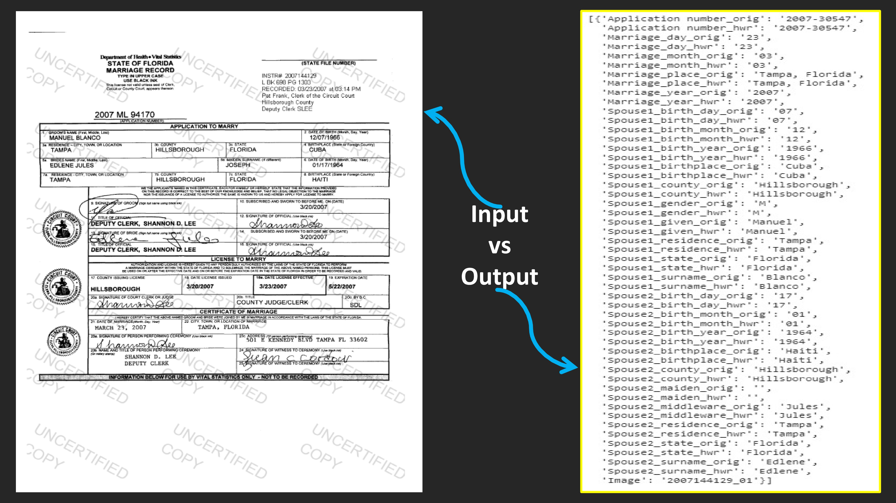

# Fine-Tuning zephyr-7B-alpha LLM

This repository contains a Jupyter notebook and supporting files for fine-tuning the zephyr-7B-alpha model, a large language model provided by Hugging Face. This process involves several critical steps to prepare, configure, and execute the fine-tuning process to customize the model for specific tasks such as information extraction from images.

[]([LinkedIn-video-URL](https://www.linkedin.com/posts/tonumoy-mukherjee-15b238125_machinelearning-ai-datascience-activity-7158835335236407296-aLuP?utm_source=share&utm_medium=member_desktop))


## Getting Started

### Prerequisites

- Python 3.8+
- PyTorch
- Hugging Face Transformers
- bitsandbytes (for efficient training)
- CUDA-compatible GPU (recommended for efficient training)
- Google Cloud Vision API credentials (for specific Image data processing tasks)

### Installation

Run requirements.txt file or run from the notebook itself

## Dataset Preparation

The fine-tuning process starts with dataset preparation. Load your dataset in CSV format and split it into training and testing sets. Replace `"your csv file path"` with the path to your dataset.

**Note:** The dataset we used for fine-tuning consisted of two primary columns: "Input" and "Output". The "Input" column contained raw text data from various sources, while the "Output" column had structured information derived from the corresponding inputs in a JSON-like format. This setup facilitated the training of the model to extract specific pieces of information from unstructured asemantic text, enabling it to understand and organize data efficiently. The dataset was tailored for tasks that require converting free-form text into structured data, making it highly suitable for natural language processing applications focused on information extraction.

```python
from datasets import load_dataset

dataset = load_dataset('csv', data_files="your csv file path")
dataset = dataset["train"].train_test_split(test_size=0.2)
```

## Tokenization

Tokenize your data using the tokenizer corresponding to the zephyr-7B-alpha model. This step converts text data into a format that can be processed by the model.

```python
from transformers import AutoTokenizer

tokenizer = AutoTokenizer.from_pretrained("HuggingFaceH4/zephyr-7b-alpha", model_max_length=784)
```

## Model Configuration and Fine-Tuning

Configure the model for fine-tuning, enabling features like gradient checkpointing and 4-bit Adam optimization for efficient training.

```python
from transformers import AutoModelForCausalLM, TrainingArguments, Trainer

model = AutoModelForCausalLM.from_pretrained("HuggingFaceH4/zephyr-7b-alpha")
```

### Training

Set up the training arguments, specifying details such as the number of epochs, batch size, and the directory to save the model.

```python
training_args = TrainingArguments(
    output_dir="./results",
    num_train_epochs=3,
    per_device_train_batch_size=4,
    warmup_steps=500,
    weight_decay=0.01,
    logging_dir="./logs",
    logging_steps=10,
)
```

Initialize the `Trainer` and start fine-tuning:

```python
trainer = Trainer(
    model=model,
    args=training_args,
    train_dataset=tokenized_train_dataset,
    eval_dataset=tokenized_val_dataset,
)

trainer.train()
```

## Evaluation and Usage

After training, evaluate the model's performance on your test dataset and save the model checkpoint for future use.

## Contributing

Contributions are welcome! Please open an issue or submit a pull request with your improvements.

